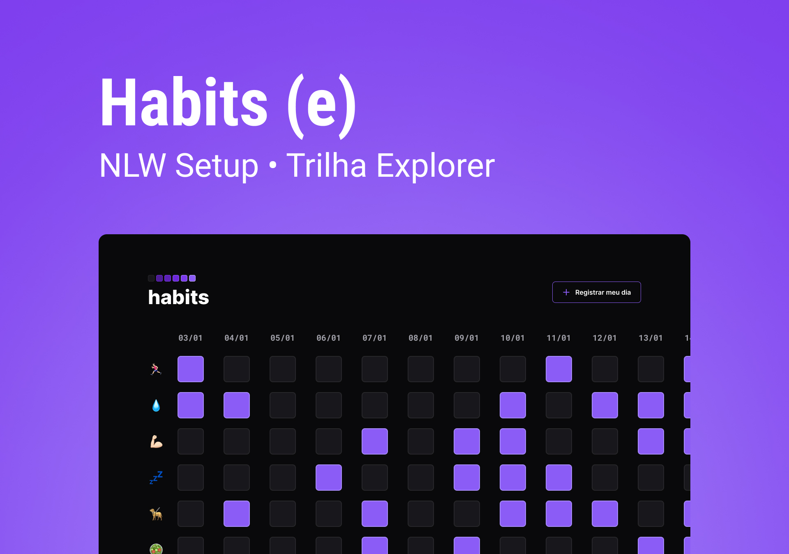

<h1 align="center"> Habits </h1>

NLW é um evento exclusivo e gratuito, promovido pra Rocketseat para ensino de tecnologias WEB.  

<a href="#-tecnologias">Tecnologias</a>&nbsp;&nbsp;&nbsp; |&nbsp;&nbsp;&nbsp;
<a href="#-projeto>Projeto</a>&nbsp;&nbsp;&nbsp; |&nbsp;&nbsp;&nbsp;
<a href="#-tlayout">Layout</a>&nbsp;&nbsp;&nbsp; |&nbsp;&nbsp;&nbsp;
<a href="#memo-licença">Licença</a>&nbsp;&nbsp;&nbsp; |&nbsp;&nbsp;&nbsp;

 

- [Visite o projeto online](https://daianypessoa.github.io/nlw-setup/)